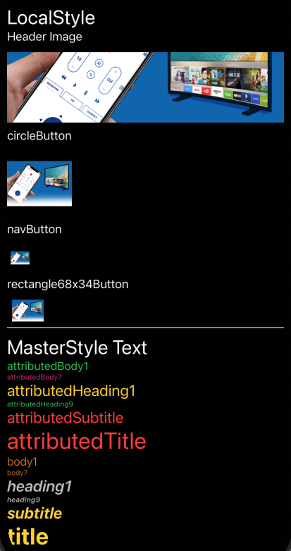
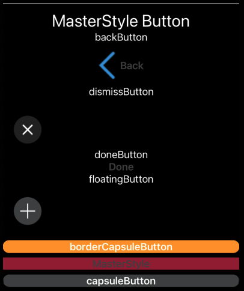

# Fiision UI

```swift
ScrollView {
    VStack(alignment: .leading) {
        //            LocalStyle.remoteBackground
        //                .ignoresSafeArea()
        Text("LocalStyle")
            .font(.title).foregroundColor(Color.white)
        Text("Header Image")
            .font(.body).foregroundColor(Color.white)
        LocalStyle.header(image: Image.bgDsBanner1, maxHeight: 100)
        Text("circleButton")
            .font(.body).foregroundColor(Color.white)
        LocalStyle.circleButton(icon: Image.bgDsBanner1, premiumIcon: Image.bgDsBanner2, height: 100) {}
        Text("navButton")
            .font(.body).foregroundColor(Color.white)
        LocalStyle.navButton(color: .red, icon: Image.bgDsBanner1) {}
        Text("rectangle68x34Button")
            .font(.body).foregroundColor(Color.white)
        LocalStyle.rectangle68x34Button(icon: Image.bgDsBanner1, premiumIcon: Image.bgDsBanner2) {}
        Rectangle()
            .frame(width: .infinity, height: 1)
    }
    VStack(alignment: .leading) {
        Text("MasterStyle Text")
            .font(.title).foregroundColor(Color.white)
        if #available(iOS 15, *) {
            MasterStyle.attributedBody1(text: "attributedBody1", bodyColor: .green)
            MasterStyle.attributedBody7(text: "attributedBody7", bodyColor: .ceriseRed)
            MasterStyle.attributedHeading1(text: "attributedHeading1", titleColor: .yellow)
            MasterStyle.attributedHeading9(text: "attributedHeading9", titleColor: .green)
            MasterStyle.attributedSubtitle(text: "attributedSubtitle", titleColor: .red)
            MasterStyle.attributedTitle(text: "attributedTitle", titleColor: .red)
            MasterStyle.body1(text: "body1", bodyColor: .orange)
            MasterStyle.body7(text: "body7", bodyColor: .orange)
        }
        MasterStyle.heading1(text: "heading1", titleColor: .silver, isItalic: true)
        MasterStyle.heading9(text: "heading9", titleColor: .silver, isItalic: true)
        MasterStyle.subtitle(text: "subtitle", titleColor: .yellow)
        MasterStyle.title(text: "title", titleColor: .yellow)
        Rectangle()
            .frame(width: .infinity, height: 1)
    }
    .frame(minWidth: 0, maxWidth: .infinity)
    VStack {
        Text("MasterStyle Button")
            .font(.title).foregroundColor(Color.white)
        Text("backButton")
            .font(.body).foregroundColor(Color.white)
        MasterStyle.backButton(foregroundColor: .curiousBlue) {}
            .frame(width: 100, height: 50)
        Text("dismissButton")
            .font(.body).foregroundColor(Color.white)
        MasterStyle.dismissButton(size: 50) {}
        Text("doneButton")
            .font(.body).foregroundColor(Color.white)
        MasterStyle.doneButton {}
        Text("floatingButton")
            .font(.body).foregroundColor(Color.white)
    }
    .frame(minWidth: 0, maxWidth: .infinity)
    VStack {
        MasterStyle.floatingButton(size: 50) {}
        MasterStyle.borderCapsuleButton(title: "borderCapsuleButton") {}
        MasterStyle.button(title: "MasterStyle", enableBackground: .oldBrick) {}
        MasterStyle.capsuleButton(title: "capsuleButton") {}
        Rectangle()
            .frame(width: .infinity, height: 1)
    }
    .frame(minWidth: 0, maxWidth: .infinity)
}
```



