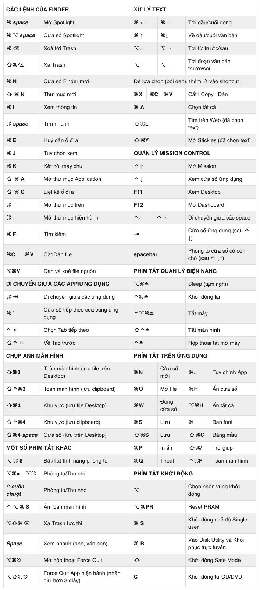

# Ghi chú cách sử dụng Mac OS

Command = Window
Option = Control

## Hiện Destop

> F11

## Go to Parent Folder

> Go> Enclosing Folder (Com + Up)

## Delete

> Command + Backspace

## Zoom

> Command + Shift + +
> Command + Shift + -

## Spotlight search

> Command + Space

## Tắt ứng dụng

> Command + Option + Esc

## Chụp màn hình

> Command + Shift + 3
> Command + Shift + 4

## Xoá file ._

> rm -rf ._*
> find . -name ._\* -delete

---
