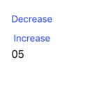

# MVVM

- [MVVM](#MVVM)
  - [Class](#Class)
    - [1 - Data Binding](#1---Data-Binding)
    - [2 - Model](#2---Model)
    - [3 - ViewModel](#3---ViewModel)
    - [4 - View](#4---View)
  - [Actions Flow](#Actions-Flow)

## Class



### 1 - Data Binding

```swift
class DataBinding<T> {
    typealias Handler = (T) -> Void
    private var handlers:[Handler] = []
    
    var value: T {
        didSet {
            self.fire()
        }
    }
    
    init(value: T) {
        self.value = value
    }
    
    func bind(hdl:@escaping Handler) {
        self.handlers.append(hdl)
    }
    
    func bindAndFire(hdl:@escaping Handler) {
        self.bind(hdl: hdl)
        self.fire()
    }
    
    private func fire() {
        for hdl in self.handlers {
            hdl(value)
        }
    }
}
```

### 2 - Model

```swift
class NumberModel {
    private var value:Int = 0
    
    init(value:Int) {
        self.value = value
    }
    
    func getValue() -> Int {
        return self.value
    }
    
    func setValue(value:Int) {
        self.value = value
    }
}
```

### 3 - ViewModel

```swift
class NumberViewModel {
    private var numberModel: NumberModel?
    
    var numberString: DataBinding<String>?
    var decreaseEnabled: DataBinding<Bool>?
    
    
    init(number: Int) {
        self.numberModel = NumberModel(value: number)
        
        self.numberString = DataBinding(value: formatNumber(number: number))
        self.decreaseEnabled = DataBinding(value: number > 0)
    }
    
    func increaseNumber() {
        guard let numberModel = self.numberModel else { return }
        
        numberModel.setValue(value: numberModel.getValue() + 1)
        
        self.updateViewWithFireEvents()
    }
    
    func decreaseNumber() {
        guard let numberModel = self.numberModel else { return }
        
        let currentValue = numberModel.getValue()
        if currentValue <= 0 { return }
        
        numberModel.setValue(value: currentValue - 1)
        
        self.updateViewWithFireEvents()
    }
    
    private func formatNumber(number:Int) -> String {
        return String(format: "%02d", arguments: [number])
    }
    
    private func updateViewWithFireEvents() {
        guard let numberModel = self.numberModel else { return }
        
        let currentValue = numberModel.getValue()
        let text = formatNumber(number: currentValue)
        
        // Fire event
        self.numberString?.value = text
        self.decreaseEnabled?.value = currentValue > 0
    }
}
```

### 4 - View

```swift
class NumberVC: UIViewController {
    
    @IBOutlet weak var numberLabel: UILabel!
    @IBOutlet weak var decreaseButton: UIButton!
    
    private let numberViewModel = NumberViewModel(number: 3)
    
    override func viewDidLoad() {
        super.viewDidLoad()
        
        // Listen data stream from View Model
        numberViewModel.numberString?.bindAndFire(hdl: { [weak self] (text) in
            guard let `self` = self else { return }
            self.numberLabel.text = text
        })
        
        numberViewModel.decreaseEnabled?.bindAndFire(hdl: { [weak self] (enabled) in
            guard let `self` = self else { return }
            self.decreaseButton.isEnabled = enabled
        })
    }
    
    override func didReceiveMemoryWarning() {
        super.didReceiveMemoryWarning()
    }
    
    @IBAction func decreaseAction(_ sender: UIButton) {
        self.numberViewModel.decreaseNumber()
    }
    
    @IBAction func increaseAction(_ sender: UIButton) {
        self.numberViewModel.increaseNumber()
    }
}
```

## Actions Flow

- (View) increaseAction
- --> (ViewModel) increaseNumber
- --> (Model) setValue
- --> (ViewModel) updateViewWithFireEvents
- --> (View) numberViewModel.numberString?.bindAndFire

---
