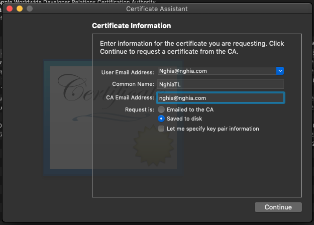
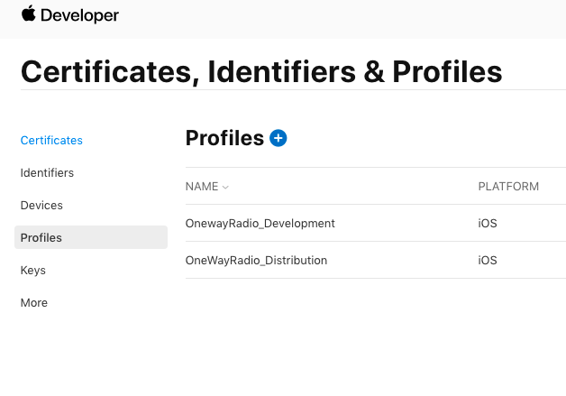
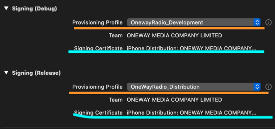

# Tạo App trên App Store

## Tạo key trong keychain

- Keychain Access/ Certificate Assistant/ Request Certificate from certificate Authority...

- Paste Login Email
[x] Save To Disk

- Tạo ra file: *.certSigningRequest

## Create Certificates, Identifiers & Profiles

Truy cập:
<https://developer.apple.com/account/resources/profiles/list>

### Create Certificates

Chứng chỉ cho App. Có thể dùng nhiều App

- Nhấp (+)
- Create a New Certificate:
  - Apple Distribution (Xcode 11 về trước)
  - iOS App Development (Sau này)
- Nhấn Continue
  - Choose File: chọn file *.certSigningRequest
- Nhấn Continue
  - Nhấn Download: file *.cer
  
- Chạy file .cer trong Keychain
- Export Certificate vừa tạo: file .p12
(Share file cho Thành viên trong nhóm)

### Create Identifiers

Id cho App.

- Nhấp (+)
- Register a New Identifier
  - App IDs (Tạo App id)
- Nhấp Continue
  - Bundle ID: App Id (Bundle Indentifier)
- Nhấp Register

### Create Devices

Add Devices UID, if want debug

### Create Profiles

Development or Distribution Profile

## Connect App Store

goto: <https://appstoreconnect.apple.com/WebObjects/iTunesConnect.woa/ra/ng/app>

- Create App. Click (+)
- App Store > App Infomation: Privacy Policy URL (must be exist page)
- Create VERSION OR PLATFORM:
  - Included Assets (must have)
  - General App Information > App Store Icon (must have)

## Note

### Update App

Delete exist Certificates, Indentifiers, Profiles

### Debug app on Other Mac

- Delete related app Certificates on app:
    > Keychain Access > My Certificates
- Install Profile Manager <https://github.com/Hipo/ProvisioningProfileManager>. Delete exist app Profiles: Profile Manager
- Share files:
  - Export Certificate: file *.p12
  - Export Profiles(only install 1 Profile for other Mac): file *.mobileprovision
- Install 2 shared files (.p12, .mobileprovision)

---
