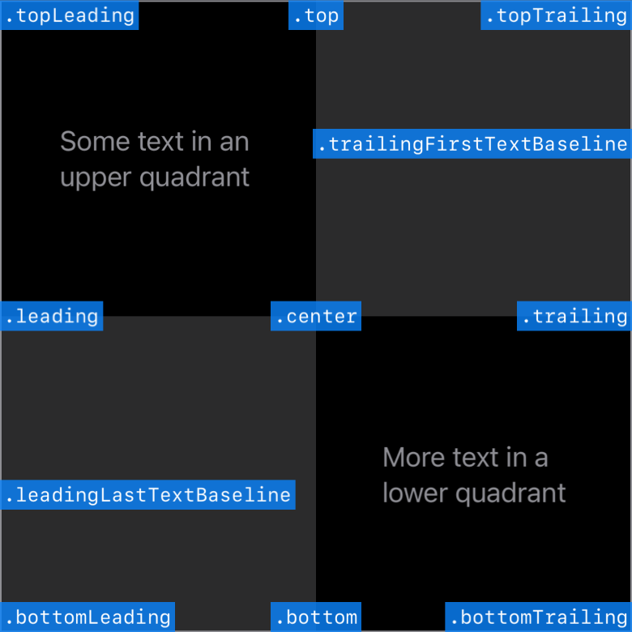

# Basic UI

## View General:

```swift
.frame(width: 80)               // Width
.frame(maxWidth: .infinity)     // fill Width, max width
.frame(alignment: .topLeading)  // Alignment
.font(.title)                   // Text Size
.foregroundColor(.secondary)    // Text color
.background(Color.blue)     // Background color
Image(systemName: "photo")  // Icon
"My name: \(variable)"      // Add Text
.clipShape(Circle())        // Cut layout
.overlay {                  // Border          
    Circle().stroke(.gray, lineWidth: 4)
}
.shadow(radius: 7)          // Shadow
.onTapGesture {             // Click, tap
    print("nghia")
}
```



## Label: Show Text and Icon

```swift
Label("Tab", systemImage: "table.furniture.fill") // systemImage: System Icon
```

## Image: Show Image

```swift
// Show Icon
Image(systemName: "photo")

// Show Image
Image("Image asset Name")
    .cornerRadius(10)   // Corner
    .aspectRatio(contentMode: .fill)    // Scale type
    .resizable()    // Allow change size
    .frame(width: 50, height: 50)   // size
```

