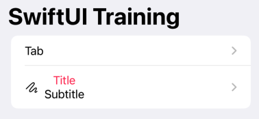

# NavigationView: Navigation to other View

```swift
struct HomeView: View {
    var body: some View {

        // ===== Config Navigation =====
        NavigationView {
            List {

                // Navigation Button
                NavigationLink {
                    Text("Custom")  // replace to ScreenView() = Navigate to ScreenView
                } label: {
                    Text("Tab")
                }
                //.buttonStyle(RowButtonStyle())    // Style
                
                // ===== Custom Navigation View =====
                NavigationLink(
                    destination: Text("Custom"),
                    label: {
                        HStack {
                            Image(systemName: "scribble")
                            VStack {
                                Text("Title")
                                    .foregroundColor(.pink)
                                Text("Subtitle")
                            }
                        }
                    })
            }
            // Navigation Title
            .navigationTitle("SwiftUI Training")
            
            // Navigation Style: .inline (small text), .large (large text)
            .navigationBarTitleDisplayMode(.inline)
        }
    }
}
```


