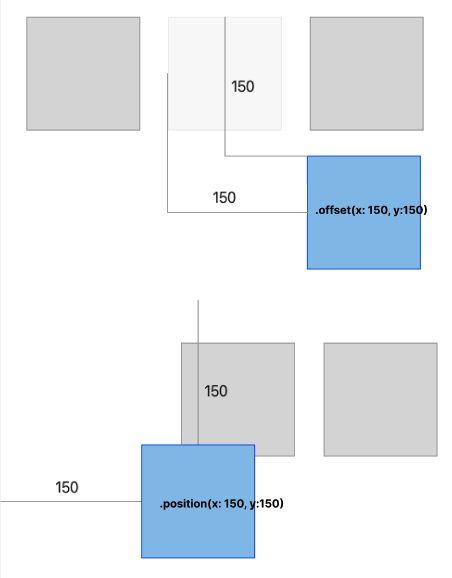

# Stack

- HStack: Horizon Container
- VStack: Vertical Container
- ZStack: Deep Container

# ZStack

```swift
.position(x: -50, y: -50)	// x,y distance with Container
.offset(x: -50, y: -50)		// x,y distance with self view
.zIndex(3)
```

