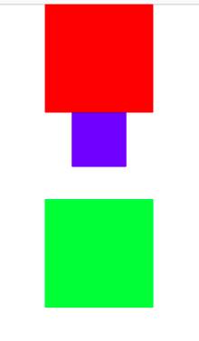

# AutoLayout by Code

- [AutoLayout by Code](#AutoLayout-by-Code)
  - [Simple Start](#Simple-Start)
  - [Some Constrains](#Some-Constrains)
  - [Some note](#Some-note)
    - [Main View](#Main-View)
    - [Refresh Layout](#Refresh-Layout)
    - [Animation with constrain](#Animation-with-constrain)
  - [Constraint with Snapkit](#Constraint-with-Snapkit)



## Simple Start

```swift
class FirstViewController: UIViewController {

    var redView: UIView!
    var didUpdateViewConstraints = false

    override func viewDidLoad() {
        super.viewDidLoad()
        setupViews()
    }

    func setupViews() {
        // Create Red View
        redView = UIView()
        redView.backgroundColor = UIColor.red
        redView.translatesAutoresizingMaskIntoConstraints = false   // apply AutoLayout, using when create View by code
        view.addSubview(redView)

        view.setNeedsUpdateConstraints()
    }

    override func updateViewConstraints() {
        if !didUpdateViewConstraints {
            let redViewConstraints = [
                NSLayoutConstraint(item: redView!, attribute: .top, relatedBy: .equal, toItem: view.safeAreaLayoutGuide, attribute: .top, multiplier: 1.0, constant: 0),
                //...
                // === Setup First Constrain Here ===
            ]
            NSLayoutConstraint.activate(redViewConstraints)

            didUpdateViewConstraints = true
        }
        super.updateViewConstraints()
    }
}
```

## Some Constrains

```swift
// RedView.Top = SafeArea.Top
NSLayoutConstraint(item: redView!, attribute: .top, relatedBy: .equal, toItem: view.safeAreaLayoutGuide, attribute: .top, multiplier: 1.0, constant: 0)

// RedView.Width = 100
NSLayoutConstraint(item: redView!, attribute: .width, relatedBy: .equal, toItem: nil, attribute: .notAnAttribute, multiplier: 1.0, constant: 100.0)

// RedView.CenterX = View.CenterX
NSLayoutConstraint(item: redView!, attribute: .centerX, relatedBy: .equal, toItem: view, attribute: .centerX, multiplier: 1.0, constant: 0)
```

## Some note

### Main View

```swift
self.view   // Contain View
self.view.safeAreaLayoutGuide   // Safe View
```

### Refresh Layout

>self.view.layoutIfNeeded()  // Refresh layout

### Animation with constrain

```swift
// Setup
var redConstraintTop: NSLayoutConstraint!
override func updateViewConstraints() {
    //...
    // RedView.Top = SafeArea.Top
    redConstraintTop = NSLayoutConstraint(item: redView!, attribute: .top, relatedBy: .equal, toItem: view.safeAreaLayoutGuide, attribute: .top, multiplier: 1.0, constant: 0)
}

// Start Animation: Top going to down from 0 to 30
 @IBAction func expandButtonPressed(_ sender: Any) {
    redConstraintTop.constant = 30.0
    UIView.animate(withDuration: 1.0) {
        self.view.layoutIfNeeded()  // Refresh layout
    }
}
```

## Constraint with Snapkit

```swift
greenView.snp.makeConstraints { (make) in
    make.width.height.equalTo(100.0)
    make.top.equalTo(blueView!.snp.bottom).offset(30.0)
    make.centerX.equalTo(self.view.snp.centerX)
}

// Same Same value
let redViewConstraints = [
    NSLayoutConstraint,
    NSLayoutConstraint
    //...
    // === Setup First Constrain Here ===
]
NSLayoutConstraint.activate(redViewConstraints)
```

---
