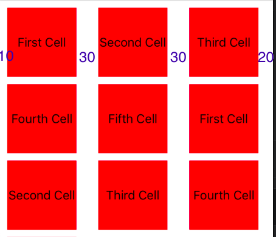

# CollectionView: Display List style Grid

## Simple Start



```swift
private let spacingLeft: CGFloat = 10.0
private let spacingRight: CGFloat = 20.0
private let spacingItemsHorizontal: CGFloat = 30.0
private let numberColumn: CGFloat = 3

class CollectionViewViewController: UIViewController {
    
    @IBOutlet weak var listView: UICollectionView!
    
    var array = ["First Cell", "Second Cell", "Third Cell", "Fourth Cell", "Fifth Cell", "First Cell", "Second Cell", "Third Cell", "Fourth Cell", "Fifth Cell"]

    override func viewDidLoad() {
        super.viewDidLoad()
        self.listView.dataSource = self
        self.listView.delegate = self
        self.listView.register(UINib(nibName: "CollectionViewCell", bundle: nil), forCellWithReuseIdentifier: "cell")
        let layout = UICollectionViewFlowLayout()
        layout.sectionInset = UIEdgeInsets(top: 10, left: spacingLeft, bottom: 10, right: spacingRight) // Khoảng cách cạnh
        layout.minimumInteritemSpacing = CGFloat(spacingItemsHorizontal) // Khoảng cách NGANG mỗi item
        layout.minimumLineSpacing = 10    // Khoảng cách DỌC mỗi item
        self.listView.collectionViewLayout = layout
    }

}

extension CollectionViewViewController: UICollectionViewDataSource, UICollectionViewDelegate, UICollectionViewDelegateFlowLayout {
    
    func collectionView(_ collectionView: UICollectionView, numberOfItemsInSection section: Int) -> Int {
        return array.count
    }
    
    func collectionView(_ collectionView: UICollectionView, cellForItemAt indexPath: IndexPath) -> UICollectionViewCell {
        let cell = collectionView.dequeueReusableCell(withReuseIdentifier: "cell", for: indexPath) as? CollectionViewCell
        cell?.titleLabel.text = array[indexPath.item]
        return cell!
    }
    
    func collectionView(_ collectionView: UICollectionView, layout collectionViewLayout: UICollectionViewLayout, sizeForItemAt indexPath: IndexPath) -> CGSize {
        // - Khoảng cách 2 cạnh (left, right) - khoảng cách ngang * số cột
        // chia số cột
        // //let width = (collectionView.bounds.width - 10.0 - 10.0 - 10.0) * 1/2
        let totalItemSpacingHoz = spacingItemsHorizontal*(numberColumn-1)
        let width = (collectionView.bounds.width - spacingLeft - spacingRight - totalItemSpacingHoz)/numberColumn
        return CGSize(width: CGFloat(width), height: CGFloat(width))
    }
}
```


