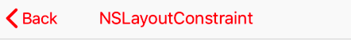
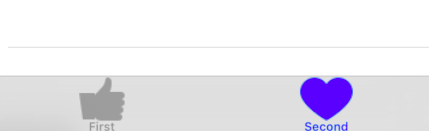

# Navigation: Điều Hướng

Di chuyển, hiển thị, tắt mở View Controller

- [Navigation: Điều Hướng](#Navigation-%C4%90i%E1%BB%81u-H%C6%B0%E1%BB%9Bng)
  - [Hiện View Controller(Nib/Xib file) trong AppDelegate](#Hi%E1%BB%87n-View-ControllerNibXib-file-trong-AppDelegate)
  - [Tạo NavigationController chứa các VC đang hiển thị](#T%E1%BA%A1o-NavigationController-ch%E1%BB%A9a-c%C3%A1c-VC-%C4%91ang-hi%E1%BB%83n-th%E1%BB%8B)
    - [Thêm VC](#Th%C3%AAm-VC)
    - [Xoá VC](#Xo%C3%A1-VC)
    - [Send Data to VC](#Send-Data-to-VC)
    - [Trả dữ liệu về VC trước (cha)](#Tr%E1%BA%A3-d%E1%BB%AF-li%E1%BB%87u-v%E1%BB%81-VC-tr%C6%B0%E1%BB%9Bc-cha)
  - [TabController in Delegate](#TabController-in-Delegate)
  - [Tham Khảo](#Tham-Kh%E1%BA%A3o)

## Hiện View Controller(Nib/Xib file) trong AppDelegate

```swift
// AppDelegate.swift
func application(...) -> Bool {
    // === Show View Controller ===
    window = UIWindow(frame: UIScreen.main.bounds)
    let homeController = HomeViewController(nibName: "HomeViewController", bundle: nil)
    // Create VC in Navigation
    //let navigation = UINavigationController(rootViewController: homeController)
    //window?.rootViewController = navigation
    window?.rootViewController = homeController
    window?.makeKeyAndVisible()
}
```

## Tạo NavigationController chứa các VC đang hiển thị

```swift
let controller = SettingViewController(nibName: "SettingViewController", bundle: nil)
let nav = UINavigationController(rootViewController: controller)
```

### Thêm VC



```swift
// Hiện VC trong Navigation đầu tiên
self.present(navigation, animated: true, completion: nil) // use for first Nav VC ==== present - close by Dismiss
// Or
self.show(navigation, sender: self)

// Hiện VC tiếp theo
self.navigationController?.pushViewController(controller, animated: true)
```

### Xoá VC

```swift
// Đóng VC cuối cùng
self.navigationController?.popViewController(animated: true)

// Clear all Stack, về lại nơi Present
self.navigationController?.dismiss(animated: true, completion: nil)
```

### Send Data to VC

```swift
// Khởi tạo trong VC2
class DetailViewController: BaseViewController {

    var post: PostDetail!

    static func create(withPost post: PostDetail) -> DetailViewController {
        let controller = DetailViewController.loadFromNib()
        controller.post = post
        return controller
    }

// Using in VC1
private func goToDetailScreen(_ postDetail: PostDetail) {
    let controller = DetailViewController.create(withPost: postDetail)
    self.navigationController?.show(controller, sender: self)
}
```

### Trả dữ liệu về VC trước (cha)

```swift
// Khởi tạo trong VC2
typealias SkinSelectHandler = (UIViewController, ClockType) -> (Void)

class SkinListViewController: UIViewController {

  static func create() -> SkinListViewController {
      return SkinListViewController(nibName: "SkinListViewController", bundle: nil) as SkinListViewController
  }

  @discardableResult
  public func onSelectedSkinHandler(_ handler: @escaping SkinSelectHandler) -> SkinListViewController {
      self.selectedSkinHandler = handler
      return self
  }

  func returnVC1() {
    // Using - VC2 return value VC1
    self.selectedSkinHandler!(self, selectedClockType)
    self.navigationController?.popViewController(animated: true) // Close VC2
  }
}

// Khai báo trong VC1
func goToSkinList() {
    let handler: SkinSelectHandler = { [weak self](controller, type) in
        // VC giữ handler có thể huỷ, không cần giữ vùng nhớ
        guard let `self` = self else { return }
        self.updateUIColor()
    }

    let controller = SkinListViewController
        .create()
        .onSelectedSkinHandler(handler)
    let nav = UINavigationController(rootViewController: controller)
    self.present(nav, animated: true, completion: nil)
}
```

## TabController in Delegate



```swift
let controller1 = FirstViewController(nibName: "FirstViewController", bundle: nil)
let nav1 = UINavigationController(rootViewController: controller1)

let controller2 = StudentViewController(nibName: "StudentViewController", bundle: nil)
let nav2 = UINavigationController(rootViewController: controller2)


let tabbarController = UITabBarController()
tabbarController.setViewControllers([nav1, nav2], animated: false)

let tabFirst = tabbarController.tabBar.items![0]
tabFirst.image = UIImage(named: "ic_like")
tabFirst.title = "First"

let tabSecond = tabbarController.tabBar.items![1]
tabSecond.image = UIImage(named: "ic_love")
tabSecond.title = "Second"

// Show in Delegate
window?.rootViewController = tabbarController
window?.makeKeyAndVisible()
```

---

## Tham Khảo

<https://github.com/codepath/ios_guides/wiki/Understanding-Navigation-in-iOS>
