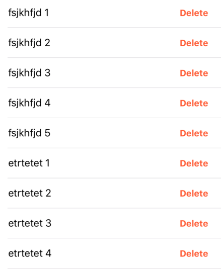
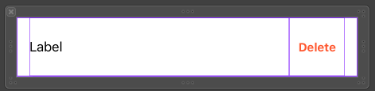

# UITableView: Hiển thị Danh sách

- [UITableView: Hiển thị Danh sách](#UITableView-Hi%E1%BB%83n-th%E1%BB%8B-Danh-s%C3%A1ch)
  - [Simple Sample](#Simple-Sample)
  - [Select Row](#Select-Row)
  - [Button in Row](#Button-in-Row)
    - [Option 1: Using Delegate](#Option-1-Using-Delegate)
    - [Option 2: Using Closure](#Option-2-Using-Closure)



## Simple Sample

- Bước 1: Tạo UITableView trong XIB hay Storyboard. Kết nối UITableView với IBOutlet
  
```swift
private let studentCellID = "student_cell_id"

class StudentViewController: UIViewController {
    
    @IBOutlet weak var listView: UITableView!    
    var studentNames = [
        "fsjkhfjd",
        "fsjkhfjd",
        "fsjkhfjd",
        "fsjkhfjd"
    ]

    override func viewDidLoad() {
        super.viewDidLoad()
        setupListView()
    }

    func setupListView() {
        listView.register(UINib(nibName: "StudentViewCell", bundle: nil), forCellReuseIdentifier: studentCellID)
        listView.dataSource = self
        listView.delegate = self
    }
}

extension StudentViewController: UITableViewDataSource, UITableViewDelegate {
    
    // Set Row number
    func tableView(_ tableView: UITableView, numberOfRowsInSection section: Int) -> Int {
        return studentNames.count
    }
    
    // Set Cell Data
    func tableView(_ tableView: UITableView, cellForRowAt indexPath: IndexPath) -> UITableViewCell {
        let cell = tableView.dequeueReusableCell(withIdentifier: studentCellID) as? SecondViewCell
        let name = studentNames[indexPath.row]
        cell?.titleLabel.text = name
        cell?.indexPath = indexPath
        return cell!
    }
}
```

- Bước 2: Tạo UITableViewCell, Cài đặt giao diện, kết nối với giao diện



```swift
class StudentViewCell: UITableViewCell {

    @IBOutlet weak var titleLabel: UILabel!
    var indexPath: IndexPath!

    override func awakeFromNib() {
        super.awakeFromNib()
    }  
}
```

## Select Row

```swift
class StudentViewCell: UITableViewCell {
    //...
    override func setSelected(_ selected: Bool, animated: Bool) {
        super.setSelected(selected, animated: animated)
    }
}
```

```swift
extension StudentViewController: UITableViewDataSource, UITableViewDelegate {
    //...
     func tableView(_ tableView: UITableView, didSelectRowAt indexPath: IndexPath) {
        let message = "Select At:" + studentNames[indexPath.item]
        self.showAlert(message)
        tableView.deselectRow(at: indexPath, animated: true)
    }

    func showAlert(_ message: String) {
        let alert = UIAlertController(title: "Ting Ting", message: message, preferredStyle: .alert)
        alert.addAction(UIAlertAction(title: "OK", style: .default, handler: nil))
        self.present(alert, animated: true, completion: nil)
    }
}
```

## Button in Row

### Option 1: Using Delegate

- Step 1: Create Delegate Struct

```swift
protocol StudentCellDelegate {
    func onDeleteTouch(_ cell: StudentViewCell, onDeleteRowAt indexPath: IndexPath)
}
```

- Step 2: Create in ViewCell

```swift
class StudentViewCell: UITableViewCell {
    //...
    var delegate: StudentCellDelegate? = nil

    @IBAction func deleteButtonPressed(_ sender: Any) {
        delegate?.onDeleteTouch(self, onDeleteRowAt: indexPath)
        //onDeleteRowHandler?(indexPath)
    }
}
```

- Step 3: Create in ViewController

```swift
extension StudentViewController: StudentCellDelegate {
    
    func onDeleteTouch(_ cell: StudentViewCell, onDeleteRowAt indexPath: IndexPath) {
        studentNames.remove(at: indexPath.row)
        //listView.reloadData() // No Animation
        listView.deleteRows(at: [indexPath], with: .automatic)
    }
}
```

### Option 2: Using Closure

```swift
class StudentViewCell: UITableViewCell {
    //...
    //var delegate: StudentCellDelegate? = nil
    public var onDeleteRowHandler: ((IndexPath) -> (Void))?

    @IBAction func deleteButtonPressed(_ sender: Any) {
        //delegate?.onDeleteTouch(self, onDeleteRowAt: indexPath)
        onDeleteRowHandler?(indexPath)
    }
}
```

```swift
extension StudentViewController: UITableViewDataSource, UITableViewDelegate {
    //...
    func tableView(_ tableView: UITableView, cellForRowAt indexPath: IndexPath) -> UITableViewCell {
        let cell = tableView.dequeueReusableCell(withIdentifier: studentCellID) as? StudentViewCell
        //...
        cell?.onDeleteRowHandler = {[weak self] (index) in
            self?.studentNames.remove(at: indexPath.row)
            //listView.reloadData() // No Animation
            self?.listView.deleteRows(at: [indexPath], with: .automatic)
        }
        return cell!
    }
}
```

---

Tham Khao