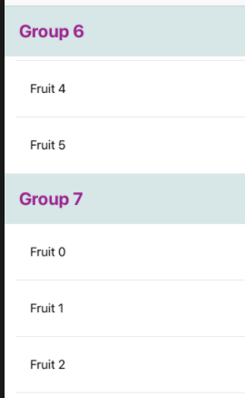

# Header in ListView



## Simple Sample

- Create Cell and Header

```swift
// Create Cell and XIB
class FruitTableViewCell: UITableViewCell {

    @IBOutlet weak var nameLabel: UILabel!
    
    override func awakeFromNib() {
        super.awakeFromNib()
        // Initialization code
    }

    override func setSelected(_ selected: Bool, animated: Bool) {
        super.setSelected(selected, animated: animated)

        // Configure the view for the selected state
    }
}

// Create Header and XIB
class FruitHeaderCell: UITableViewHeaderFooterView {
    @IBOutlet weak var nameLabel: UILabel!
}
```

- Create Model

```swift
// [name: String, fruits:[fruit]]
class GroupFruit {
    var name: String
    var fruits: [Fruit]

    init(name: String, vegetables: [Fruit]) {
        self.name = name
        self.fruits = vegetables
    }

    static func createGroupFruits() -> [GroupFruit] {
        var fruitList = [GroupFruit]()
        for i in 0...100 {
            var fruits = [Fruit]()
            for j in 0...5 {
                fruits.append(Fruit(
                    name: "Fruit \(j)",
                    avatarUrl: "https://dictionary.cambridge.org/vi/images/thumb/tomato_noun_001_17860.jpg"
                ))
            }
            fruitList.append(GroupFruit(name: "Group \(i)", vegetables: fruits))
        }
        return fruitList
    }
}

class Fruit {

    var name: String
    var avatarUrl: String

    init(name: String, avatarUrl: String) {
        self.name = name
        self.avatarUrl = avatarUrl
    }
}
```

- Create on ViewController

```swift
private let fruitCellId = "fruit_cell"
private let fruitHeaderId = "fruit_header"

class TableViewWithHeaderViewController: UIViewController {

    @IBOutlet weak var fruitTableView: UITableView!
    var fruitList = GroupFruit.createGroupFruits()

    override func viewDidLoad() {
        super.viewDidLoad()
        setupTableView()
    }
    
    func setupTableView() {
        fruitTableView.register(UINib(nibName: "FruitTableViewCell", bundle: nil), forCellReuseIdentifier: fruitCellId)
        fruitTableView.register(UINib(nibName: "FruitHeaderCell", bundle: nil), forHeaderFooterViewReuseIdentifier: fruitHeaderId)
        fruitTableView.delegate = self
        fruitTableView.dataSource = self
        
        // === Auto Height Header ===
        self.fruitTableView.sectionHeaderHeight = UITableView.automaticDimension;
        self.fruitTableView.estimatedSectionHeaderHeight = 25;
    }
}

extension TableViewWithHeaderViewController: UITableViewDelegate, UITableViewDataSource {
    func tableView(_ tableView: UITableView, numberOfRowsInSection section: Int) -> Int {
        return fruitList[section].fruits.count
    }
    
    func tableView(_ tableView: UITableView, cellForRowAt indexPath: IndexPath) -> UITableViewCell {
        let cell = tableView.dequeueReusableCell(withIdentifier: fruitCellId) as? FruitTableViewCell
        let fruit = fruitList[indexPath.section].fruits[indexPath.row]
        cell?.nameLabel.text = fruit.name
        return cell!
    }
    
    // === Create header ===
    func numberOfSections(in tableView: UITableView) -> Int {
        return fruitList.count
    }
    
    func tableView(_ tableView: UITableView, viewForHeaderInSection section: Int) -> UIView? {
        let cell = tableView.dequeueReusableHeaderFooterView(withIdentifier: fruitHeaderId) as? FruitHeaderCell
        let groupFruit = fruitList[section]
        cell?.nameLabel.text = groupFruit.name
        return cell
    }
}
```

---