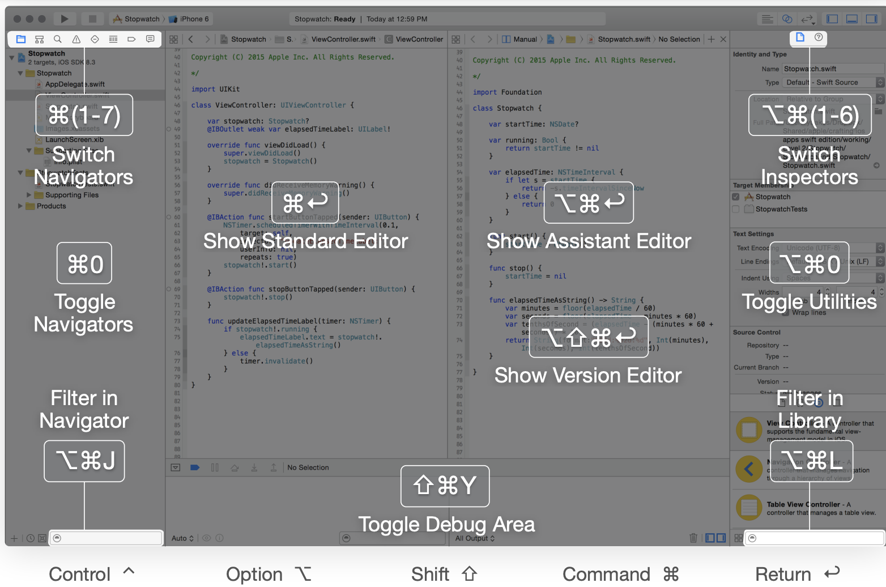
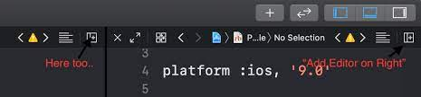

# XCode Note

## General

### Editor navigate

### Run: ⌘R (Command + R)

### Clean (Product/ Clean): ⇧⌘K (Shift + Command + K)

### Mở nhanh file: ⇧⌘O (Shift + Command + O)

### Mở cửa sổ phía dưới: giữ OPT (OPTION) + Nhấn Open Editor

### Tìm text trong File: ⌘F

### Tìm text trong project: ⇧⌘F (Shift + Command + F)

### Tạo File: ⌘N

### Mở Tab mới: ⌘T

### Đóng Tab hiện tại: ⌘W

### Gợi ý code (Show Completions): Control Space

### Formatting Code (Re-Indent): ⌃I (Control + I) - Editor/ Structure/ Re-Indent

### Comment: Command + /

### Show Assistant Editor: ⌥⌘⏎ (Option + Command + Enter)

## -

| Code Editing                       |        |
|------------------------------------|--------|
| Show completions (Code Suggestion) |⌃Space  |
| Next completion (Code Suggestion)  |⌃.      |
| Comment selection                  |⌘/      |
| Fold method/class                  |⌥ ⌘←    |
| Unfold method/class                |⌥ ⌘→    |
| Edit all in scope (= rename var)   |⌘^E     |
| Build & Run                        |        |
| Build ⌘B                           |⌘B      |
| Analyze ⇧⌘B                        |⇧⌘B     |
| Run ⌘R                             |⌘R      |
| Profile ⌘I                         |⌘I      |
| Test ⌘U                            |⌘U      |
| Clean ⇧⌘K                          |⇧⌘K     |
| Clear console ⌘K                   |⌘K      |
| Duplicate File (File/Duplicate)    |⌘^S     |

| File Navigation                    |        |
|------------------------------------|--------|
| Go forward ⌃⌘→                     |⌃⌘→     |
| Go back ⌃⌘←                        |⌃⌘←     |
| Open quickly (open file)⇧⌘O        |⇧⌘O     |
| Show related items ⌃ 1             |⌃ 1     |
| Debugging                          |        |
| Next issue ⌘'                      |⌘'      |
| Previous issue ⌘"                  |⌘"      |
| Fix next issue ⌃⌘'                 |⌃⌘'     |
| Fix previous issue ⌃⌘"             |⌃⌘"     |
| Add breakpoint ⌘\                  |⌘\      |
| Activate breakpoints ⌘Y            |⌘Y      |
| Add - Find (Symbols, image, UI)    |⌘^L     |

| Code Navigation                    |        |
|------------------------------------|--------|
| End of line ⌘→                     |⌘→      |
| Beginning of line ⌘←               |⌘←      |
| Top of file ⌘↑                     |⌘↑      |
| Bottom of file ⌘↓                  |⌘↓      |
| Next word ⌥ →                      |⌥ →     |
| Previous word ⌥ ←                  |⌥ ←     |
| Goto line ⌘L                       |⌘L      |
| Find in file ⌘F                    |⌘F      |
| Find in project ⇧⌘F                |⇧⌘F     |
| Find next ⌘G                       |⌘G      |
| Find previous ⇧⌘G                  |⇧⌘G     |